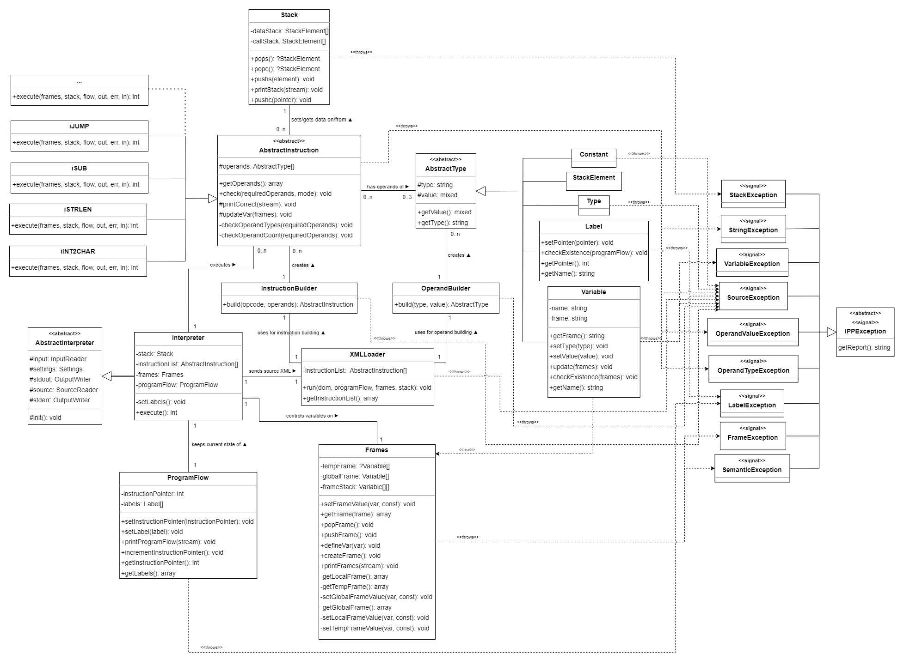

## Documentation of 2nd Project Implementation for IPP 2023/2024
### Name and surname: Iaroslav Zhdanovich
### Login: xzhdan00

### Interpreter for IPPcode24 language structure:

</img>

* [Interpret class](#interpret-class)
* [XMLLoader class](#xmlloader-class)
* [OperandBuilder class](#operandbuilder-and-instructionbuilder-classes)
* [InstructionBuilder class](#operandbuilder-and-instructionbuilder-classes)
* [Frames class](#frames-class)
* [ProgramFlow class](#programflow-class)
* [Stack class](#stack-class)
* [Instructions classes](#instructions-classes)
* [Types classes](#types-classes)
* [Exceptions classes](#exceptions-classes)

#### Now, let's examine the functionality of each component separately

### Interpret class
The Interpret class is the entry point of the program. It instantiates the XMLLoader, Frames, ProgramFlow, and Stack classes.
Then it passes the XML file to the XMLLoader class to parse it and get the list of instructions. 
Using its own setLabels() method it sets the labels before instructions are executed. 
After that, it iterates over the instructions using the ProgramFlow class and executes them one by one.

### XMLLoader class
The XMLLoader class is responsible for parsing the XML file and returning the list of instructions. 
It uses the xml.etree.ElementTree library to parse the XML file. It reads the root element and iterates over its children.
For each child, it performs different checks to ensure that the XML file is valid and if not, it raises an appropriate exception.
If the XML file is valid, it creates an instance of the corresponding instruction class using OperandBuilder and InstructionBuilder classes, and adds it to the list of instructions.

### OperandBuilder and InstructionBuilder classes
The OperandBuilder class is a simple helper class that is used to isolate the logic of creating operands from the XMLLoader class.
Its main method createTypeInstance() is used to create an instance of the corresponding type class based on the type attribute of the operand element.
If the type is not recognized, it raises an appropriate exception.
The InstructionBuilder class shares a similar purpose, but it is used to create instances of the corresponding instruction classes using its createInstructionInstance() method based on the opcode given in the XML file.
If the opcode is not recognized, it raises an appropriate exception.

### Frames class
The Frames class is responsible for managing the frames of the program. 
Its attributes are dictionaries that store the variables of the program: the temporary frame, the local frame, and the global frame.
It provides different methods to manipulate the frames, such as creating a new frame, pushing a variable to the frame, or pushing a new frame to the stack etc.
Each method has its own set of checks to ensure that the operation is valid and if not, it raises an appropriate exception.
The printFrames() method is used to print the frames for debugging purposes.

### ProgramFlow class
The ProgramFlow class is responsible for managing the program flow.
It has InstructionPointer attribute that stores the index of the current instruction and labels attribute that stores the mapping of labels to their corresponding instruction index.
It provides different methods to manipulate its attributes. 
The setLabel() method ahs integrated checks to ensure that the label is unique and if not, it raises an appropriate exception. 
The printProgramFlow() method is used to print the program flow for debugging purposes.

### Stack class
The Stack class is responsible for managing the data stack and call stack of the program.
It has two attributes: dataStack and callStack that are arrays used to store the data stack and call stack respectively.
The elements of both stacks are instances of the StackElement class that stores the type and value of the data or the return address of the call.
The class provides different methods to manipulate the stacks, such as pushing or popping elements.
The popc() and pops() methods have integrated checks to ensure that the stack is not empty and if it is, it raises an appropriate exception.
The printStack() method is used to print the stacks for debugging purposes.

### Instructions classes
The AbstractInstruction class is the base class for all instruction classes.
Its only attribute is the operands array that stores the operands of the instruction.
The class provides the check() method that is used to check the validity of the operands, updateVar() method that is used to update all variables in the operands using the Frames class, and getOperands() method that is used to get the operands of the instruction.
The check() method is used to check the validity of the operands of the instruction and has different modes of checking based on the instruction.
If the operands are not valid, it raises an appropriate exception.
The abstract execute() method is implemented in each concrete instruction class and is used to execute the instruction.
It gets all the necessary data from the Frames, ProgramFlow and Stack classes and performs the operation.
The whole execution process is using its own operand list, so if the instruction works with variables, it 'pulls' their type and value from the frames first.
All I/O operations are done using ipp-core.

### Types classes
The AbstractType class is the base class for all type classes.
Its attributes are type and value that store the type and value of the type respectively.
The only methods it provides are getType() and getValue() that are used to get the type and value respectively.
The Constant, StackElement, Type, Variable and Label classes are concrete implementations of the AbstractType class.
The Constant class is used to store the constant values of the program.
Special type-value checks are built into the constructor to ensure that the constant is valid.
The StackElement class is used to store the data or return address on the stack.
It is essentially a wrapper around the AbstractType class used to store data on the stack and pass data to frames.
The Type class is used to store the types used in the operands of the instructions.
Special value checks are built into the constructor to make sure the type is correct.
The Variable class is used to store the variables of the program.
It has additional attributes that store the frame and the name of the variable.
It provides set of setters and getters to manipulate the variables, update() method to update the value from the frame, and checkExistence() method to check if the variable exists in the frame.
The Label class is used to store the labels of the program.
Its getPointer() and getName() methods are basically getters for the instance's value and type, made for better readability.
The checkExistence() method is used to check if the label exists in the programFlow.

### Exceptions classes
The Exceptions classes are used to handle different types of exceptions that can occur during the execution of the program.
Every exception class inherits from the IPPException class. The return code of the exception is set in the constructor.

